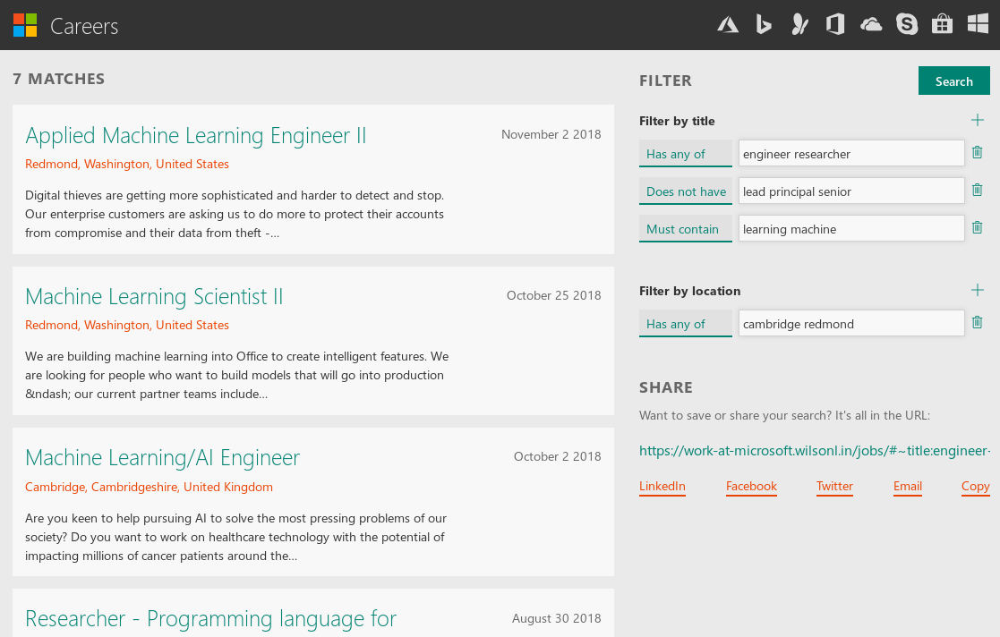

# [wilsonl.in/msft](https://wilsonl.in/msft)

An at-edge web service + app for finding careers at Microsoft, built as a demo for [edgesearch](https://github.com/wilsonzlin/edgesearch).

Faster and more precise than the official website, and comes with a nice UI.



## Improvements

This app allows the combining of simple filters to form advanced, precise queries.
Combined with the performance optimisations, it delivers far more filtered results in usually under a second.

For a UI comparison, see the [screenshots folder](./screenshots).

## Technical

### Data

All jobs available on careers.microsoft.com are fetched and processed into an array of JSON objects.
Each object represents a job, with fields describing some aspect of the job:

```json
{
  "ID": "19234",
  "title": "Azure Service Engineer",
  "description": "Hello world",
  "date": "2018-1-3",
  "location": "Redmond, Washington, United States"
}
```

The `title`, `location`, and `description` fields are searchable. This means that their words have to be indexed using bit fields.

## Code

### Backend

The worker code is built using [edgesearch](https://github.com/wilsonzlin/edgesearch). See the project for more details.

### Frontend

All the app files are located in [src](./src/):

- `page.hbs`: main HTML file, written as a Handlebars template to remove repetition and allow conditional content
- `script.js`: custom JS that contains logic for autocomplete, animations, searching, and general UX
- `style.css`: styling for the app
- various external libraries and styles
- `assets/*`: files relating to app metadata, such as `favicon.ico`

All files except for `assets/*` are minified and bundled together into one HTML file to reduce the file size and amount of round trips required for the end user.

### Data

Data fetching and processing is done by [data.ts](./build/src/data/data.ts).

### Build

Both the worker and client app need to be built. [client.ts](./build/src/client/client.ts) and [worker.js](./build/src/worker/worker.ts) take care of building.

Building the worker requires at least clang 7 and lld 7. 
